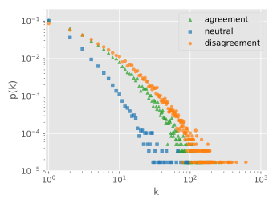

# Leveraging LLMs to create semantically enriched citation networks
## research-project

By Mads Høgenhaug, Marcus Friis, Morten Pedersen.



This repo contains all code and data used for producing the accompanying paper. The created *Cit-Hep-Ph-Aug* dataset can be found in:
* [Edge list with labels](data/Cit-HEP-PH-Aug.txt)
* [Abstract embeddings](<https://www.mediafire.com/file/im0jf93tdihemrg/combined_data.rar/file>)

The base dataset augmented is *[Arxiv HEP-PH (high energy physics phenomenology) citation graph](https://snap.stanford.edu/data/cit-HepPh.html)*.

### Abstract embeddings

Abstract embeddings are created using Llama2 13B. Specifically, we use *[openbuddy-llama2-13b-v11.1.Q5_K_M](https://huggingface.co/TheBloke/OpenBuddy-Llama2-13B-v11.1-GGUF)*, and interact with it through [llama-cpp-python](https://github.com/abetlen/llama-cpp-python). 

Embeddings are created using [embedder.py](src/embedder.py), which iterate through abstracts from [arxiv.csv](data/arxiv.csv), embeds prompts and stores them in embeds.json. The core of the script is the embedding part. Embeddings are created as follows
```
from llama_cpp import Llama
llama_kwargs = {
    embedding: True,
    ...
}
llama = Llama(**llama_kwargs)
prompt = 'SAMPLE PROMPT'
embedding = llama.embed(prompt)
```

We ran this code through the IT University of Copenhagen's HPC cluster, which allowed us to use the 13B parameter model.

### Edge labeling

Edge labels were achieved with ChatGPT, interacting with it through its API. The code is in [chatgpt.py](src/chatgpt.py). To facilitate batch prompts, we implement the prompting in an asynchronous manner. The implemented class *Chad* handles the asynchronous requests, with logic for handling timeouts, retrys and various relevant errors. To use it, you must insert your API key in config.ini. When running, you specify how many edges you want to label through the CLI. For more modifications, changes has to be made to the script, or the *Chad* class can be imported into another script. It can be run as follows:
> cd src
> python chatgpt.py start_index end_index

Where start_index and end_index indicate the range of edges you want to label. 

### Producing the results

All results are produced by scripts located in [src](src).
